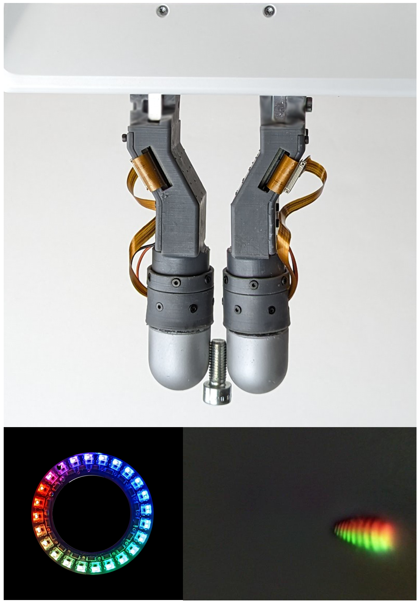
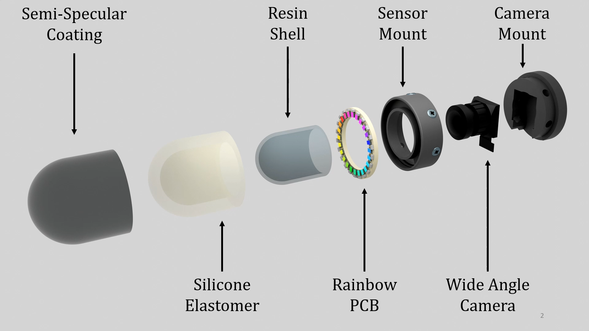
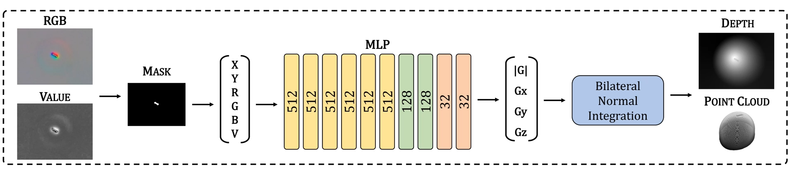
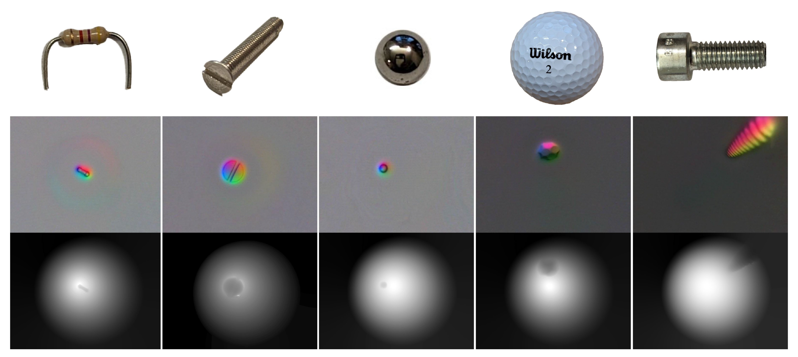

[Paper](files/RainbowSight.pdf) \ [Paper Link](https://ieeexplore.ieee.org/document/10609863) \ [Poster](files/icra24_poster_v2.pdf) \ [ICRA 7-Minute Video Presentation](https://youtu.be/1epQ4mHNrZg)

## Abstract

  

    
  

  

    Camera-based tactile sensors can provide high resolution positional and local geometry information for robotic manipulation. Curved and rounded fingers are often advantageous, but it can be difficult to derive illumination systems that work well within curved geometries. To address this issue, we introduce RainbowSight, a family of curved, compact, camera-based tactile sensors which use addressable RGB LEDs illuminated in a novel rainbow spectrum pattern. In addition to being able to scale the illumination scheme to different sensor sizes and shapes to fit on a variety of end effector configurations, the sensors can be easily manufactured and require minimal optical tuning to obtain high resolution depth reconstructions of an object deforming the sensor’s soft elastomer surface.
  

  Additionally, we show the advantages of our new hardware design and improvements in calibration methods for accurate depth map generation when compared to alternative lighting methods commonly implemented in previous camera-based tactile sensors. With these advancements, we make the integration of tactile sensors more accessible to roboticists by allowing them the flexibility to easily customize, fabricate, and calibrate camera-based tactile sensors to best fit the needs of their robotic systems.
 

## Sensor Exploded View

  

 

## Rainbow Illumination Approach ##
# Trial Size#
We introduce a novel rainbow illumination scheme that uses a semi-specular, or shiny, coating to produce the graual, rainbow color gradient needed for using photometric stereo techniques. This illumination method allows us to further simplify our fabrication process, without sacrificing the sensor's ability to provide depth reconstructions of the surface deformations. 

The rainbow illumination approach allows us to broaden the shape and size customizability (introduced by GelSight360) to now build a wider variety of sensors without the need for precise illumination or color tuning. 

This simplified ray casting visualization demonstrates how a light ray from two LEDs is refracted and reflected through the difference materials in the sensor. 
 

  <video style="width: 100%; height: auto;" controls>
    <source src="noSound_IluminationApproach.mp4" type="video/mp4">
    Your browser does not support the video tag.
  </video>

 

When an object is pressed into the soft elastomer, the light ray is reflected into the camera, giving us an RGB intensity value at that pixel. Using the color gradient around the circumference of the sensor and the light intensities, a neural network can be used to map the RGB images to surface normals. 
## Rainbow LED Circuitry

  <video style="width: 100%; height: auto;" controls>
    <source src="raw_sensor_signal.mp4" type="video/mp4">
    Your browser does not support the video tag.
  </video>

 
 

# Manufacturing Method
Both the rigid epoxy shell and silicone elastomer are produced in-house. Including curing time, the process takes about 2 days. 

  <video style="width: 100%; height: auto;" controls>
    <source src="fabrication_method.mp4" type="video/mp4">
    Your browser does not support the video tag.
  </video>

 
 

# Sensor Calibration and Depth Reconstruction

  

The sensor is first calibrated by using a CNC to collect about 5000 points across the sensor's surface. Using the intrinsic and extrinsic camera matrices, we simulate the normal maps and train an MLP network to produce the surface normals of the sensor surface. 

We were able to produce depth reconstructions of the sensor's surface. 

  

 
