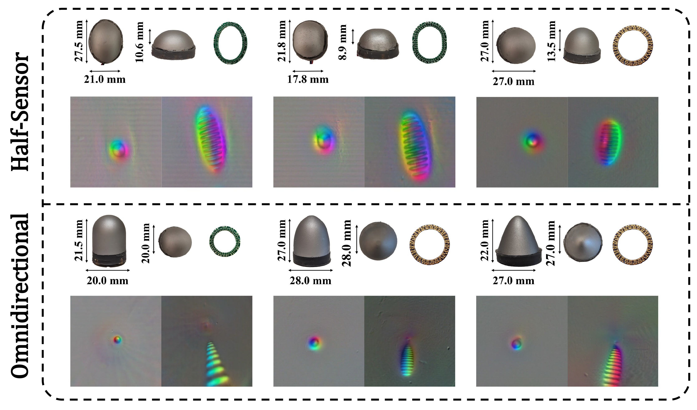

[Paper](files/RainbowSight.pdf) \ [Paper Link](https://ieeexplore.ieee.org/document/10609863) \ [Poster](files/icra24_poster_v2.pdf) \ [ICRA 7-Minute Video Presentation](https://youtu.be/1epQ4mHNrZg)

# Abstract #

  

    
  

  

    Camera-based tactile sensors can provide high resolution positional and local geometry information for robotic manipulation. Curved and rounded fingers are often advantageous, but it can be difficult to derive illumination systems that work well within curved geometries. To address this issue, we introduce RainbowSight, a family of curved, compact, camera-based tactile sensors which use addressable RGB LEDs illuminated in a novel rainbow spectrum pattern. In addition to being able to scale the illumination scheme to different sensor sizes and shapes to fit on a variety of end effector configurations, the sensors can be easily manufactured and require minimal optical tuning to obtain high resolution depth reconstructions of an object deforming the sensor’s soft elastomer surface.
  

  Additionally, we show the advantages of our new hardware design and improvements in calibration methods for accurate depth map generation when compared to alternative lighting methods commonly implemented in previous camera-based tactile sensors. With these advancements, we make the integration of tactile sensors more accessible to roboticists by allowing them the flexibility to easily customize, fabricate, and calibrate camera-based tactile sensors to best fit the needs of their robotic systems.

# Our Approach #

### Sensor Exploded View ###

  

### Rainbow Illumination ###
We introduce a novel rainbow illumination scheme that uses a semi-specular, or shiny, coating to produce the graual, rainbow color gradient needed for using photometric stereo techniques. This illumination method allows us to further simplify our fabrication process, without sacrificing the sensor's ability to provide depth reconstructions of the surface deformations. 

The rainbow illumination approach allows us to broaden the shape and size customizability (introduced by GelSight360) to now build a wider variety of sensors without the need for precise illumination or color tuning. 
 

  <video style="width: 100%; height: auto;" controls>
    <source src="noSound_IluminationApproach.mp4" type="video/mp4">
    Your browser does not support the video tag.
  </video>

 
This simplified ray casting visualization demonstrates how a light ray from two LEDs is refracted and reflected through the difference materials in the sensor. 

When an object is pressed into the soft elastomer, the light ray is reflected into the camera, giving us an RGB intensity value at that pixel. Using the color gradient around the circumference of the sensor and the light intensities, a neural network can be used to map the RGB images to surface normals. 

### Rainbow LED Circuitry ###

  

    
  

  

    
We are able to imitate the rainbow-like gradients seen in past Lambertian GelSights due to the Rainbow illumination strategy.

    
This is done by packing as many RGB LEDs as we can fit onto the PCB. A specific hue, value, and saturation is assigned to each of the discrete LEDs, and when there are enough LEDs, we start to mimic this continuous rainbow color. Depending on the shapes of boards, we use different sizes of LEDs in the design, but generally, 21 – 28 LEDs can fit.

    
Additionally, we designed a customized LED controller board that houses an Adafruit Trinket 5V Pro. It is small enough to fit at the base of an end effector or in the palm of a robotic hand and ensures the signal integrity for the sensors. The Trinket board has the current capacity to run up to 5 LED boards off from an external power supply, which is important when outfitting multiple sensors on a robotic hand.

  

### Example Raw Sensor Outputs ###

  <video style="width: 100%; height: auto;" controls>
    <source src="raw_sensor_signal.mp4" type="video/mp4">
    Your browser does not support the video tag.
  </video>

 
 

### Manufacturing Process ###
Both the rigid epoxy shell and silicone elastomer are produced in-house. The process takes ~2 days, including curing time. 

  <video style="width: 100%; height: auto;" controls>
    <source src="fabrication_method.mp4" type="video/mp4">
    Your browser does not support the video tag.
  </video>

 

# Alternate Geometries #
Different shapes and sizes of sensors are now possible without the need to re-design optical schemes and fine-tune LED colors for curved configurations. The RGB LEDs can just be arranged on a PCB around the circumference of the sensor footprint, as shown below. 

  

  

  

    
  

  

    
 Some of the alternate geometries implemented were designed to mimic the dimensions of Syntouch's BioTac sensors. Unlike with GelSight360, we were even able to shrink the size of the sensors down to ~20mm in diameter (about the diameter of a human index finger) and still implement the rainbow illumination.

  

# Depth Reconstruction #
### Method ###
The sensor is first calibrated by using a CNC to collect about 5000 points across the sensor's surface. Using the intrinsic and extrinsic camera matrices, we simulate the normal maps and train an MLP network to produce the surface normals of the sensor surface. 

To reconstruct the surface deformation, the RGB values and pixel coordinates of the contact area are fed into the network, producing the surface gradients. These gradients are then integrated using the Bilateral Normal Integration method to produce a depth map and point cloud. 

  

### Results ### 

  

Example tactile signals collected when different objects are pressed at different locations of the sensor surface. ***Top Row:*** Objects pressed into the sensor surface. ***Middle Row:*** Tactile difference images of the contact regions. ***Bottom Row:*** Estimated depth map of the imprinted object in the sensor skin. 

